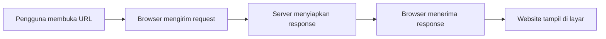
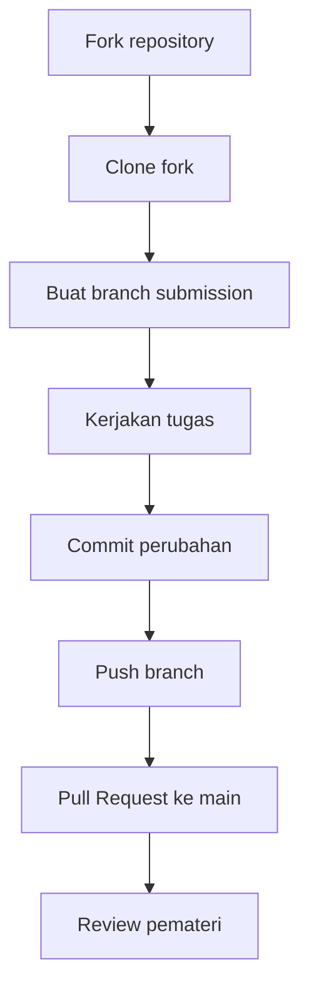

# Modul 01 — Cara Kerja Website

Modul ini adalah pembuka singkat sebelum masuk ke Git/GitHub dan JavaScript. Target penyampaian: 5-10 menit.

## Tujuan

Setelah modul ini, peserta mampu menjelaskan:

- Apa yang terjadi saat pengguna membuka URL.
- Peran browser dan server.
- Perbedaan sederhana frontend, backend, dan database.
- Peran HTML, CSS, dan JavaScript.
- Mengapa Git dan GitHub dibutuhkan saat website dikerjakan bersama.

## Contoh Pembuka

Buka website MokletDev, misalnya:

[https://dev.moklet.org/](https://dev.moklet.org/)

Pertanyaannya:

> Ketika alamat website diketik lalu Enter ditekan, dari mana halaman itu datang?

Jawaban sederhananya: browser meminta halaman ke server, lalu server mengirimkan balasan yang bisa ditampilkan browser.

## Alur Saat Membuka Website



1. Pengguna membuka URL.
2. Browser mengirim **request** atau permintaan.
3. Server menerima permintaan dan menyiapkan **response**.
4. Browser menerima response.
5. Browser menampilkan hasilnya sebagai halaman website.

## Frontend, Backend, dan Database

| Bagian | Penjelasan sederhana | Contoh |
| --- | --- | --- |
| Frontend | Bagian website yang dilihat dan digunakan pengguna | Halaman, tombol, form |
| Backend | Bagian yang memproses aturan aplikasi | Login, validasi, pengolahan data |
| Database | Tempat menyimpan data | Akun, profil, daftar project |

Contoh ketika pengguna login:

1. Pengguna mengisi form di frontend.
2. Backend memeriksa apakah datanya benar.
3. Database menyimpan atau mengambil data akun.
4. Frontend menampilkan hasilnya kepada pengguna.

## HTML, CSS, dan JavaScript

Website biasanya terdiri dari tiga bagian dasar:

| Teknologi | Peran |
| --- | --- |
| HTML | Membuat struktur halaman |
| CSS | Mengatur tampilan halaman |
| JavaScript | Memberi logika dan interaksi |

Contoh sederhana:

- HTML membuat tombol.
- CSS membuat tombol terlihat rapi.
- JavaScript menentukan apa yang terjadi saat tombol diklik.

Pada workshop ini, kita belajar dasar JavaScript terlebih dahulu menggunakan Node.js. Setelah logikanya paham, JavaScript bisa dipakai untuk interaksi website.

## Mengapa Git dan GitHub Dibutuhkan?

Saat website dikerjakan bersama, file akan sering berubah. Developer perlu cara untuk:

- Mencatat perubahan.
- Melihat file apa yang sedang diubah.
- Menyimpan versi pekerjaan dengan pesan yang jelas.
- Mengirim perubahan ke repository online.
- Meminta review sebelum perubahan digabung.

Git membantu mencatat perubahan di laptop. GitHub membantu menyimpan repository online dan mendukung kolaborasi.



## Hubungan Materi Hari Ini

```text
Browser dan server
-> website terdiri dari HTML, CSS, dan JavaScript
-> JavaScript memberikan logika/interaksi
-> developer menggunakan Git untuk mengelola perubahan
-> GitHub digunakan untuk menyimpan dan berkolaborasi
```

## Cek Pemahaman

Jawab singkat:

1. Siapa yang mengirim request saat kita membuka website?
2. Apa perbedaan sederhana antara frontend dan backend?
3. Mengapa GitHub berguna saat project dikerjakan bersama?

## Transisi ke Modul Git/GitHub

Sekarang kita tahu bahwa website adalah kumpulan file dan logika yang terus berubah. Selanjutnya kita belajar cara developer mengelola perubahan itu menggunakan Git dan GitHub.
