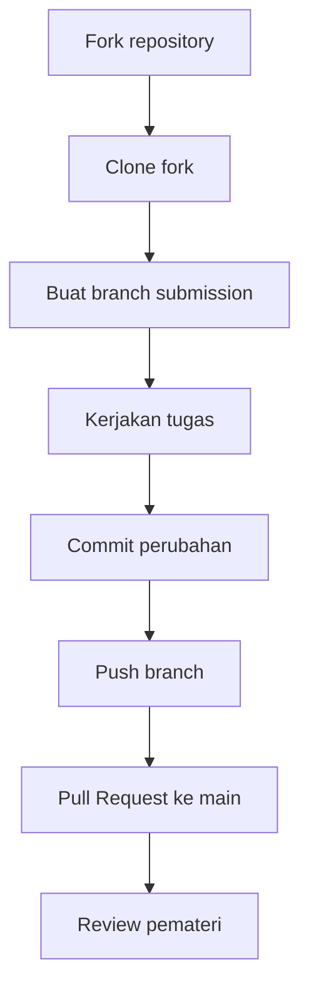

# Modul 02 — Git dan GitHub Basic

Modul ini melatih workflow kontribusi yang dipakai saat project dikerjakan bersama.

Target pemahaman:

```text
Fork repository
-> clone fork
-> buat branch submission
-> ubah file
-> periksa perubahan
-> masukkan ke staging
-> simpan sebagai commit
-> push branch ke fork
-> ajukan Pull Request ke main
```

## Git dan GitHub

| Istilah          | Penjelasan sederhana                                                   |
| ---------------- | ---------------------------------------------------------------------- |
| Git              | Aplikasi di laptop untuk mencatat perubahan file                       |
| GitHub           | Website untuk menyimpan repository Git secara online dan berkolaborasi |
| Repository utama | Repository workshop milik penyelenggara                                |
| Fork             | Salinan repository utama di akun GitHub peserta                        |

Peserta bekerja melalui fork agar tidak membutuhkan akses write ke repository utama.

## Konsep Dasar

| Konsep            | Arti                                                                                    |
| ----------------- | --------------------------------------------------------------------------------------- |
| Repository        | Folder project yang riwayat perubahannya dicatat oleh Git                               |
| Working directory | Folder kerja yang sedang kamu edit                                                      |
| Modified file     | File yang sudah berubah tetapi belum disimpan sebagai commit                            |
| Staging area      | Tempat memilih file yang akan masuk commit                                              |
| Commit            | Simpanan perubahan dengan pesan                                                         |
| Branch            | Jalur kerja terpisah dari`main`                                                       |
| Push              | Mengirim commit dari laptop ke GitHub                                                   |
| Pull Request      | Permintaan agar perubahan pada branch peserta diperiksa dan dibandingkan dengan`main` |

`main` adalah branch utama yang harus dijaga tetap stabil. Pekerjaan baru dilakukan di branch terpisah:

```text
submission/<username-github>
```

## Workflow Visual



## 1. Fork Repository

1. Buka repository workshop utama di GitHub.
2. Klik **Fork**.
3. Pilih akun GitHub milikmu.
4. Tunggu sampai repository salinan selesai dibuat.

Repository utama tetap milik penyelenggara. Fork adalah tempat peserta menyimpan branch dan commit miliknya.

## 2. Clone Fork Peserta

Clone URL dari akun GitHub milikmu sendiri:

```bash
git clone https://github.com/<username-github>/<nama-repository>.git
cd <nama-repository>
```

Jangan keliru meng-clone repository utama jika kamu hendak melakukan push. Push dilakukan ke fork milikmu.

Periksa remote:

```bash
git remote -v
```

`origin` harus mengarah ke `https://github.com/<username-github>/<nama-repository>.git`.

## 3. Buat Branch Baru

Buat branch dengan format:

```bash
git switch -c submission/<username-github>
```

Contoh:

```bash
git switch -c submission/elangsyadewa
```

Jika Git versi lama belum mendukung `git switch`, gunakan:

```bash
git checkout -b submission/<username-github>
```

Periksa branch aktif:

```bash
git branch --show-current
```

Output-nya harus:

```text
submission/<username-github>
```

Output-nya tidak boleh `main`.

## 4. Kerjakan Tugas di Folder Unik

Setiap peserta hanya mengubah folder miliknya sendiri:

```text
submissions/<username-github>/
├── profile.md
└── javascript/
    ├── task-01-profile.js
    └── task-02-cek-kelulusan.js
```

Contoh:

```text
submissions/elangsyadewa/
├── profile.md
└── javascript/
    ├── task-01-profile.js
    └── task-02-cek-kelulusan.js
```

Jika mengerjakan bonus, tambahkan:

```text
submissions/<username-github>/javascript/bonus-anggota-metic.js
```

File JavaScript di `modules/03-basic-javascript/tasks/` adalah template. Jangan edit template sebagai jawaban akhir. Salin file template ke folder submission milikmu, lalu kerjakan salinannya.

Buat folder:

```bash
mkdir -p submissions/<username-github>/javascript
```

Di Windows PowerShell:

```powershell
New-Item -ItemType Directory -Force submissions/<username-github>/javascript
```

Isi `profile.md`:

```markdown
# Profil Peserta

Nama:
Kelas/Jurusan:
Username GitHub:
Minat teknologi:
Alasan mengikuti MokDev:
```

## 5. Periksa dan Commit

Periksa perubahan:

```bash
git status
```

Masukkan folder submission milikmu ke staging area:

```bash
git add submissions/<username-github>/
```

Periksa ulang:

```bash
git status
```

Buat commit:

```bash
git commit -m "feat: add submission for <username-github>"
```

`git add .` boleh dikenalkan sebagai tambahan, tetapi jangan menjadi command utama untuk pemula. Risikonya: semua perubahan di folder saat ini ikut masuk staging, termasuk file yang tidak sengaja berubah.

## 6. Push Branch ke Fork

Push branch, bukan `main`:

```bash
git push -u origin submission/<username-github>
```

`-u` menghubungkan branch lokal dengan branch di GitHub. Setelah itu, push berikutnya cukup:

```bash
git push
```

## 7. Buat Pull Request

Setelah push berhasil, buka GitHub dan buat Pull Request dengan konfigurasi:

```text
base repository: <repository-workshop-utama>
base branch: main

head repository: <username-peserta>/<nama-repository>
compare branch: submission/<username-github>
```

Judul Pull Request:

```text
Submission: <Nama Peserta> (@<username-github>)
```

Pull Request membandingkan branch peserta dengan `main`. Perubahan harus diperiksa sebelum digabungkan.

## Satu Branch dan Satu Pull Request

Untuk workshop ini, gunakan satu branch sepanjang sesi:

```text
submission/<username-github>
```

Kamu boleh membuat Pull Request awal setelah `profile.md`. Setelah latihan JavaScript selesai, commit dan push lagi ke branch yang sama. Pull Request yang sama otomatis ikut diperbarui.

Pull Request bukan salinan satu commit. Pull Request membandingkan branch sumber dengan branch tujuan, sehingga commit baru yang di-push ke branch yang sama akan otomatis masuk ke Pull Request tersebut.

## Setelah Praktik Git

Latihan JavaScript nanti juga mengikuti workflow yang sama:

1. Salin template task ke `submissions/<username-github>/javascript/`.
2. Jalankan file dengan Node.js.
3. Pastikan tidak ada error.
4. Cek perubahan dengan `git status`.
5. Tambahkan folder submission dengan `git add submissions/<username-github>/`.
6. Commit.
7. Push branch dengan `git push`.
8. Periksa Pull Request yang sama di GitHub.

## Cheatsheet

Buka [CHEATSHEET.md](CHEATSHEET.md) untuk ringkasan command yang bisa dipakai setelah workshop.
